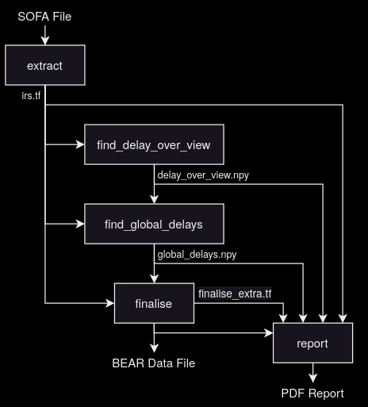

# impulse response pre-processing for BEAR

The BEAR uses an impulse response dataset stored in a data file, in a custom format; the contents of this file are described briefly in [EBU Tech 3396] section 3.1 "Data File".

[EBU Tech 3396]: https://tech.ebu.ch/publications/tech3396

See [Justification](#justification) for the reasons for doing this.

Users can use a default data file (available in releases, and installed with
the EAR Production Suite), but processing scripts are provided so that other
impulse response sets can be used.

Although effort has been made to make this work properly, support is limited
(especially if the sofa file is not publicly available) and users must validate
the results themselves.

That said, the BEAR maintainers are interested in building a library of data
files for free impulse response sets, so feel free to open issues for those.

## Usage

Processing is split into 5 stages, which are described below. The final stage
produces a report which can be used to check for problems with the processing;
the plots in this report are explained in the step which they relate to.

The five steps and how they relate are shown in this figure:

The scripts can be ran manually, or automated using snakemake; see
[Snakemake](#snakemake).

### 1: `extract`

This takes a SOFA file, selects the needed impulse responses, and writes them
to an intermediate file, along with the corresponding emitter positions and
view angles.

For BRIRs, use:

    python -m bear.process_irs.extract --ir-selection-algo closest --brir-in irs.sofa --tf-out irs.tf

For HRIRs, use:

    python -m bear.process_irs.extract --hrir-in irs.sofa --tf-out irs.tf

`--ir-selection-algo` controls how emitters are selected; the default works
well for dense IR sets where the emitters are arranged in layers with the same
elevation, but may not be appropriate for sparse BRIR sets; check the `IR
positions` plot in the report to see if this is working properly.

### 2: `find_delay_over_view`

For each emitter and ear, this finds delays which are smooth with respect to
the view angle. This is only needed for IR sets that have multiple view angles.

    python -m bear.process_irs.find_delay_over_view --tf-in irs.tf --out delays_over_view.npy

This can take a significant amount of time (say, 30 minutes), and the progress
may appear stalled while the first batch is processed.

`--opt-steps` can be used to adjust the quality of the optimisation against the
time taken.

This can be assessed by looking at plots like `simulated annealing log for
M+060, right ear` in the report: if the energy is still decreasing at the end
of the run, or the last improvement is too late, or there is no period of
gradually reducing energy, more steps may be required.

In addition the report has plots like `delays for M+060, left ear`, which shows:

- `estimate`: The initial estimated delay, which should be mostly smooth with
  some positive ripples, especially likely around the highest point.

- `smoothed estimate`: A smoothed version of `estimate`, which should be close
  to and always less than `estimate`.

- `anneal`: The results of running simulated annealing to maximise
  cross-correlation; should again be mostly smooth with small deviations
  expected around the maximum point

- `final`: The final delay, a smoothed version of `anneal`; this should be
  close to `anneal` and not obviously affected by noise in `anneal`.

### 3: `find_global_delays`

This step finds the delay for each loudspeaker and ear, considering the delays over the views if required.

For a single view:

    python -m bear.process_irs.find_global_delays --tf-in irs.tf --out global_delays.npy

For multiple views:

    python -m bear.process_irs.find_global_delays --tf-in irs.tf --in-delays delays_over_view.npy --out global_delays.npy

`--opt-steps` may be used as above. This should be checked against the
`simulated annealing log when merging speaker+ear delays` plot in the report.

The final delay quality can be assessed by looking at the report:

- Plots like `ITDs for all head orientations for mid-layer loudspeakers` should
  show lines which are the same shape (within each plot), the same shape as the
  spherical model, and are aligned vertically.

- Plots like `IRs for mid-layer loudspeakers` should show good alignment in the
  time domain at the leading edge.

### 4: `finalise`

This step takes the extracted IRs and delays, processes the IRs, and writes the
final data file.

For BRIRs:

    python -m bear.process_irs.finalise --label "example v1" --tf-in irs.tf --delays global_delays.npy --tf-out bear_data.tf --hoa-decoder bear/process_irs/data/AmbiHOA3_magLS.sofa --extra-out finalise_extra.tf

For HRIRs, add "--window none" to disable windowing.

This writes `bear_data.tf`, the final data file which can be used with
`bear-render` or the EPS binaural monitoring plugin, and `finalise_extra.tf`,
which is only used for the report.

The used window is shown in the `maximum amplitude of the start of all irs and
the applied window` and `maximum amplitude of the start of all irs and the
applied window` plots.

### 5: `report`

This step produces the processing report, which should be reviewed to check for problems in the processing:

For one view:

    python -m bear.process_irs.report --tf-in bear_data.tf --extra-in finalise_extra.tf --in-merged-delays global_delays.npy --out report.pdf

For multiple views, add `--in-delays delays_over_view.npy`.

## Using Snakemake

Snakemake is a build system, used to automate data processing. A basic
snakemake setup for processing SOFA files and producing test files is provided
in bear/process_irs.

To use this:

- make a folder for input files:

      mkdir -p ir_processing/sofas/
      cp example.sofa ir_processing/sofas/

- pick an appropriate configuration from
  bear/process_irs/snakemake_config.yaml, for example `brir` or `hrir`.

- run snakemake; in this case processing `example.sofa` with configuration `hrir`:

      snakemake -c1 -s bear/process_irs/Snakefile -d ir_processing reports/hrir/example.pdf

  this makes the BEAR data file `ir_processing/bear_data/hrir/example.tf`, and
  the report in `ir_processing/reports/hrir/example.pdf`.

## Requirements

The easiest way to get the requirements is to use nix to start a shell with
everything required installed:

    nix develop .#bear_dsp

Alternatively the requirements are listed in the `dsp_tools` value in flake.nix.

## Justification

A custom data format is used instead of SOFA files, because:

- A significant amount of pre-processing is required to turn data in a SOFA
  file into the data required by the renderer. This is non-obvious, may require
  tweaks for different SOFA files, takes time, and would likely require extra
  libraries.

- The data file contains data which is not derived from SOFA files.

- SOFA is hard to implement; it is based on HDF5 which is extremely baroque,
  and SOFA itself combines the necessary complexity to represent many different
  shapes of data in different ways (which we don't need), with extra
  unnecessary complexity (which can be avoided).

- The custom format can be memory-mapped, while HDF5 can not. This speeds up
  initialisation, and reduces memory usage when multiple renderer instances are
  running at the same time.

In general this significantly reduces implementation complexity, and improves performance.
